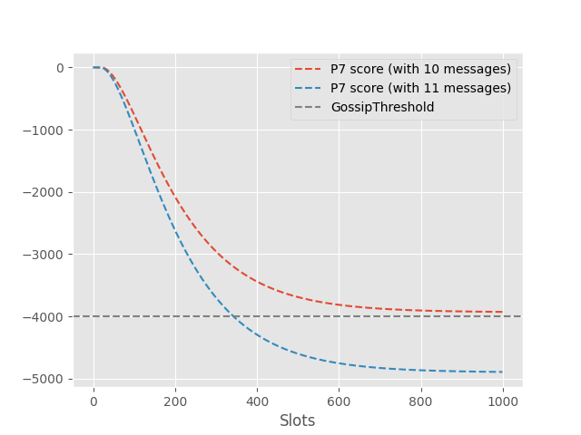
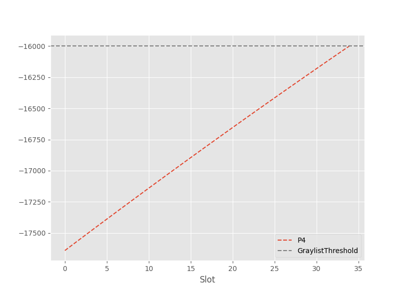
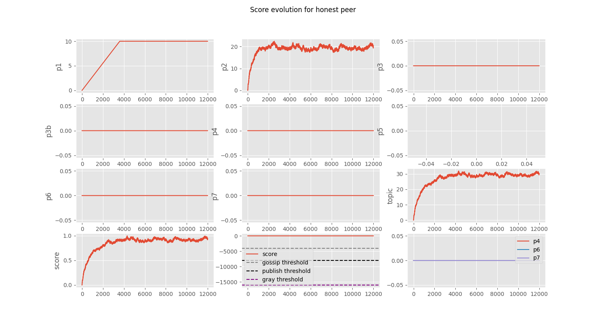
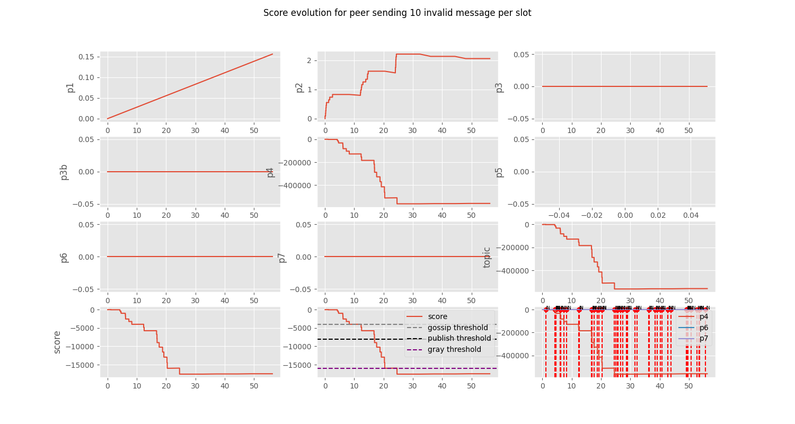
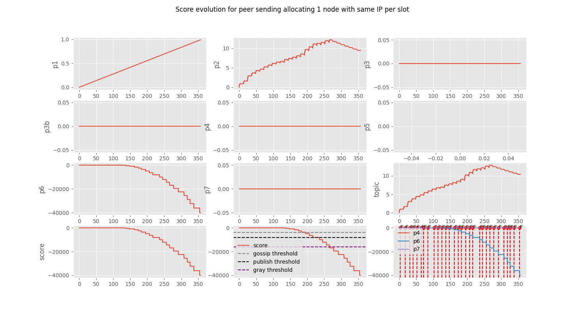
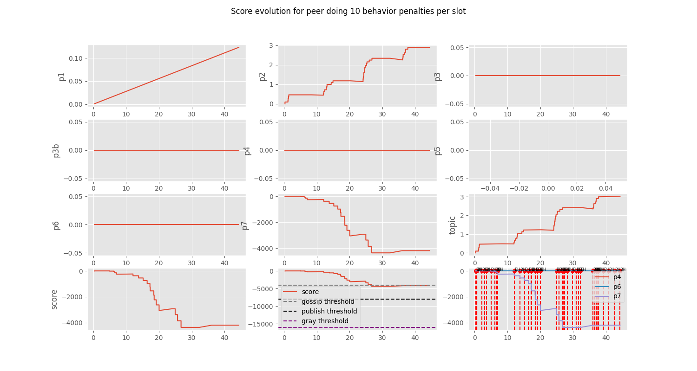

# GossipSub Score Optimization

> [!NOTE]
> To review the basics of the GossipSub scoring system, check out the [explanatory file](./../ScoreOptimization/basics.md)

<!-- omit in toc -->
## Parameter Generator

We used a [parameter generator](https://gist.github.com/MatheusFranco99/31f80e77cc7828cee2fb424a23f48ba9) which was forked from a [generator for the Ethereum network](https://gist.github.com/blacktemplar/5c1862cb3f0e32a1a7fb0b25e79e6e2c) and adjusted to the SSV case.

We'll specify how we calculate:
- [GossipSub Score Optimization](#gossipsub-score-optimization)
    - [Network Configurations](#network-configurations)
    - [Overall Parameters](#overall-parameters)
    - [P5 (App specific)](#p5-app-specific)
    - [P6 (IP Collocation)](#p6-ip-collocation)
    - [P7 (Bad behavior according to GossipSub router)](#p7-bad-behavior-according-to-gossipsub-router)
    - [P1 (Time in Mesh)](#p1-time-in-mesh)
    - [P2 (First message deliveries)](#p2-first-message-deliveries)
    - [P3 (Penalty for not sufficient msg sending rate)](#p3-penalty-for-not-sufficient-msg-sending-rate)
    - [P4 (Validator)](#p4-validator)
  - [Comparison to Ethereum Values](#comparison-to-ethereum-values)
  - [Simulation](#simulation)
    - [Honest peer](#honest-peer)
    - [Peer sending invalid messages (P4)](#peer-sending-invalid-messages-p4)
    - [Peer increasing its IP allocation (P6)](#peer-increasing-its-ip-allocation-p6)
    - [Peer doing behavior penalties (P7)](#peer-doing-behavior-penalties-p7)

### Network Configurations

To compute some parameters, we use an estimated message rate. For that, we use statistics from the stage.

In stage, we have 128 subnets and we process approximately 600 messages per second for 10000 validators. Thus, the number of messages per subnet per second is $\frac{600}{128} = 4.6875$.

### Overall Parameters

| `GossipThreshold` | `PublishThreshold` | `GraylistThreshold` | `AcceptPXThreshold` | `OpportunisticGraftThreshold` |
|-------------------|--------------------|---------------------|---------------------|-------------------------------|
| -4000             | -8000              | -16000              | 100                 | 5                             |
| `DecayInterval`   | `DecayToZero`      | `RetainScore`       | `TopicScoreCap`     | `TopicWeight`                 |
| 384 (1 epoch)     | 0.01               | 38400 (100 epochs)  | 32.72               | 0.03125                       |

- The threshold values are kept the same.
- The `DecayInterval` is set to one epoch duration (384 seconds). Note that the decay value can be adjusted, according to the `DecayInterval` we want, to produce the same result. Also, we should be careful to decrease the interval since it may increase resource consumption.
- The `DecayToZero` value is set to 0.01.
- `RetainScore` is 100 epochs.
- If we want to separate topics' importance on the score, we could assign weights accordingly. If we don't differentiate (and we won't for now), we can establish a common value
$$TopicWeight = \frac{TotalTopicsWeight}{subnets}$$

$TotalTopicsWeight$ is set to $4.0$, and, thus, $TopicWeight = 0.03125$.

- Regarding $TopicScoreCap$. The Ethereum generator calculates it in the following way. The only two sources of positive scores are $P_1$ and $P_2$, except from the app-specific score ($P_5$). We can define a maximum score for each and, then, the total maximum positive score will be $MaxPositive = (\max_i P_1(t_i)* w_1 + \max_i P_2(t_i)*w_2) * TotalTopicsWeight$. The Ethereum generator defines $\max_i w_1*P_1(t_i) = 10$ and $\max_i w_2 * P_2(t_i) = 40$, and, thus, $MaxPositive = (10+40)*4 = 200$. Then, it defines

$$TopicScoreCap = \frac{MaxPositive}{2} = 100$$

In contrast, [Prysm defines](https://github.com/prysmaticlabs/prysm/blob/f49b2b96571da5649ec63329ab0472e3e688fa2e/beacon-chain/p2p/gossip_scoring_params.go#L82) $TopicScoreCap = 32.72$.

Which value should we adopt? When defining the $TopicScoreCap$, there are three considerations to take into account:
1. The value should not be high enough to let a malicious peer delay its ban after some malicious activity.
2. The value should be higher than `OpportunisticGraftThreshold` (5) to allow peers to benefit from good behavior.
3. The value may be lower than `AcceptPXThreshold` (100) if the application decides that no peer should suggest other peers to connect.

Consideration (1) is solved by the definition of other penalty parameters. Both 100 and 32.72 follow the considerations (2) and (3). However, if we decide not to let any peer suggest other peers to connect, then we would need to discard the 100 option. We actually could use any value in the range [5, 100], but we decided to follow with $TopicScoreCap = 32.72$.

### P5 (App specific)

| `AppSpecificWeight` |
| ------------------- |
| 0                   |

- The weight is 0 for now because we don't use any app-specific score (note that message validation regards $P_4$, not $P_5$).

### P6 (IP Collocation)

| `IPColocationFactorThreshold` | `IPColocationFactorWeight` |
| ----------------------------- | -------------------------- |
| 10                            | -32.72                     |

- It is set to support a maximum of 10 nodes with the same IP.
- The threshold is set to $-TopicScoreCap$ to burn down the maximum topic positive score by a single IP excess.

### P7 (Bad behavior according to GossipSub router)

| `BehaviourPenaltyDecay` | `BehaviourPenaltyThreshold` | `BehaviourPenaltyWeight` |
| ----------------------- | --------------------------- | ------------------------ |
| 0.6309573444801932      | 6                           | -8.986961427779512       |

- The counter threshold is set to 6. This means that if the counter gets higher than 6, the peer will start being penalized.
- The decay is calculated in a way to reduce 1 to 0.01 in 10 epochs. In other words, it reduces a value to 1% after 10 epochs. The decay for that is 0.6309573444801932.
- Regarding the weight, in the original simulator, it's defined in such a way as to allow a peer to keep doing indefinitely at most 10 behavior penalties per epoch such that at infinity it will reach the $GossipThreshold$ (note that we aim the $GossipThreshold$ because this bad behavior is associated with control messages (gossiping)). If one does more than 10 behavior penalties per epoch, then it will, eventually, reach the $GossipThreshold$. In advance, the proper weight for that is -8.986961427779512, but let's digest how this value is reached in the next paragraphs.

Firstly, we need to know the counter value for a peer that keeps doing 10 bad behaviors each epoch. Let's generalize to $r$ bad behavior occurrences every decay interval. When the first interval ends, before decay, the counter will be $r$. When the second interval ends, it will become $r*d + r$, where $d$ is the decay factor. After the n-th interval, we will have

$$ r*d^{n-1} + r*d^{n-2} + ... + r*d + r $$

At infinity, this becomes

$$r + r * d + r * d^2 + r * d^3 + ... = \frac{r}{1-d}$$

Using the decay defined above and a rate of $10$ penalties per decay interval, the counter value at infinity is 27.097138638119553. The weight should be $\frac{GossipThreshold}{(MaxAcceptedCounterBeforeBanning-Threshold)^2} = \frac{-4000}{(27.097138638119553-6)^2} = -8.986961427779512$. Note that we subtract the counter from the threshold and square it because we only penalize a peer after the counter is higher than the threshold and, in the GossipSub code, the excess from the threshold is squared when computing the score.

A problem is that it may take long to reach the threshold, as shown below. For instance, if one sends 11 messages, it only breaks the threshold after 343 slots.

 
<em>Fig. 1: P7 at infinity.</em>

If we want the value to converge to the $GossipThreshold$ faster, we can increase the weight. However, this type of bad message doesn't consume much resources and we need to account for unfulfilled `IWANT` promises that may occur.

### P1 (Time in Mesh)

| `TimeInMeshQuantum` | `TimeInMeshCap` | `TimeInMeshWeight` |
| ------------------- | --------------- | ------------------ |
| 12                  | 300             | 0.03333            |

- The quantum is set to one slot.
- The cap is set to 300, which may be achieved after an hour.
- The weight is simply the $\max_i w_1*P_1(t_i)$ value divided by the cap for the counter of $P_1$. Which gives us $\frac{10}{300} = 0.03333$.

### P2 (First message deliveries)

| `FirstMessageDeliveriesDecay` | `FirstMessageDeliveriesCap` | `FirstMessageDeliveriesWeight` |
| ----------------------------- | --------------------------- | ------------------------------ |
| 0.3162277660168379            | 658.113883008419            | 0.12155950826367326            |

- The decay is set to decrease from 1 to 0.01 (to 1%) in 4 epochs, that is, 0.3162277660168379.
- The cap is the convergence value if one keeps sending, as a first sender, twice the number of messages that it's expected to send (which is the expected number of messages divided by $D$). Let's denote $m$ as the total expected number of messages to be received during a decay interval, $d$ as the decay factor and $D$ the GossipSub degree (or mesh size) parameter, if one keeps sending twice the expected number of messages that it should send, the counter will become

$$\frac{2*m}{D} + \frac{2*m}{D} * d + \frac{2*m}{D} * d^2 + ... = \frac{2*m}{D} * \frac{1}{1-d}$$

For our case, a single validator would send $\frac{600}{10000}$ messages per second. Considering the decay interval, the message rate per decay interval becomes $32\times 12\times \frac{600}{10000}$. If we account for all validators in a topic, with uniform distribution, we have a rate of $\frac{V}{128}\times 32\times 12\times \frac{600}{10000}$. Due to the cluster-based consensus optimization, we dampen this rate by $0.15$, and finally, $m = 0.15\times \frac{V}{128}\times 32\times 12\times \frac{600}{10000}$.

For $V = 20000$, we would get 197.43416490252568 as our cap value.

- The weight is computed as $w_2 = \frac{80}{cap}$. Thus, for $V = 20000$, we would get $w_2 = 0.40519836087891087$.

### P3 (Penalty for not sufficient msg sending rate)

Currently, P3 and P3b are disabled using a weight of 0. But, for the future, one possible approach is as depicted next.

| `MeshMessageDeliveriesActivation` |  `MeshMessageDeliveriesWindow`   | `MeshMessageDeliveriesDecay` |
| --------------------------------- | -------------------------------- | ---------------------------- |
| 1152 (3 epochs)                   | 2                                | 0.7498942093324559           |
| `MeshMessageDeliveriesWeight`     | `MeshMessageDeliveriesThreshold` | `MeshMessageDeliveriesCap`   |
| -0.9887692952202195               | 107.93909035018464               | 1727.0254456029543           |
| `MeshFailurePenaltyDecay`         | `MeshFailurePenaltyWeight`       |                              |
| 0.7498942093324559                | -0.9887692952202195              |                              |

- The decay is set to decrease from 1 to 0.01 (to 1%) in 16 epochs, which is 0.7498942093324559.
- The threshold is set in such a way that the peer sends at least a fraction of what is expected from it. For Ethereum, the fraction is 1/50 which is conservative. If we want to penalize peers by not sending too many messages more rapidly, we can increase this fraction. Let's say we expect to receive a total of $m$ messages per decay interval. One who keeps sending the least required amount will have as counter, after decay,
$$d * (\frac{m}{50} + \frac{m}{50} * d + \frac{m}{50} * d^2 + ...) = \frac{m}{50} * \frac{1}{1-d} - \frac{m}{50} = d * \frac{m}{50} * \frac{1}{1-d}$$
For $m = 4.6875\times 12 \times 32 = 1800 $, the threshold will be 107.93909035018464.
- The weight is defined as $-\frac{MaxPositiveScore}{TopicWeight*Threshold^2}$ which is -0.9887692952202195 (OBS: in the code, the score is calculated by squaring the difference of the counter to the threshold value. We consider that in the worst case, when the counter is 0, we want to burn the maximum positive score and, thus, the difference is exactly the threshold value).
- The cap, used not to allow a peer to increase this counter too much, is defined as the $16 \times Threshold$, 1727.0254456029543.
- The window to consider a message near the first and to account for message delivery is 2 seconds.
- The activation time for this score is 3 epochs.
- The $P_3b$ parameters are set to have the same values as for $P_3$.

### P4 (Validator)

| `InvalidMessageDeliveriesDecay` | `InvalidMessageDeliveriesWeight` |
| ------------------------------- | -------------------------------- |
| 0.954992586021436               | -1280.0                          |

- The decay is set to decrease from 1 to 0.01 (to 1%) in 100 epochs, which is 0.954992586021436.
- Regarding the weight, we could calculate it as we did with $P_7$, allowing an acceptable rate of invalid messages per epoch. But, then, we would face the problem that it may be too slow. So, better it is to calculate it another way. Suppose we may allow up to 20 messages invalid messages in a topic until graylisting a peer, then we need $w_4 = \frac{GraylistThreshold}{TopicWeight \times 20^2}$. Note that we square the counter since, in the GossipSub code, the counter is squared to compute the score. Also, the $TopicWeight$ is included in the denominator to cancel with the topic weight in the final score. The resulting value is -1280.0. Note that if a peer has been graylisted (reached the $GraylistThreshold$) and if it sends another invalid message after the decay "re-joins" it, its score will decrease to $(21)^2 * w_4 * TopicWeight = -16000 + (-25600) * 0.03125 = -17640.0$. For the decay to "re-join" it again, it will take more than 34 slots ($\approx$ 1 epoch), as can be seen below. If we want to slow this process even further, we can increase the decay value.

 
<em>Fig. 1: P4 recovery.</em>

## Comparison to Ethereum Values

The following table compares the values proposed for SSV in this document against the values proposed for Ethereum in [Blacktemplar's spreadsheet](https://docs.google.com/spreadsheets/d/1y0DalL4PVBodg1wLlvXjJcnbItwmSmiHdd4z2TTYiNY/edit#gid=0).

| Parameter                         | SSV (V = 20k)       | Eth Proposal    | Eth Attestation |
|-----------------------------------|---------------------|-----------------|-----------------|
| Thresholds                        |                     |                 |
| `GossipThreshold`                 | -4000               | -4000           | -4000           |
| `PublishThreshold`                | -8000               | -8000           | -8000           |
| `GraylistThreshold`               | -16000              | -16000          | -16000          |
| `AcceptPXThreshold`               | 100                 | 100             | 100             |
| `OpportunisticGraftThreshold`     | 5                   | 5               | 5               |
| Overall Parameters                |                     |                 |
| `TopicScoreCap`                   | 32.72               | 35.5            | 35.5            |
| `DecayInterval`                   | 384                 | 12              | 12              |
| `DecayToZero`                     | 0.01                | 0.01            | 0.01            |
| `RetainScore`                     | 38400               | 38400           | 38400           |
| $P_5$                             |                     |                 |
| `AppSpecificWeight`               | 0                   | 0               | 0               |
| $P_6$                             |                     |                 |
| `IPColocationFactorThreshold`     | 10                  | 10              | 10              |
| `IPColocationFactorWeight`        | -32.72              | -35.5           | -35.5           |
| $P_7$                             |                     |                 |
| `BehaviourPenaltyDecay`           | 0.6309573444801932  | 0.9857          | 0.9857          |
| `BehaviourPenaltyThreshold`       | 6                   | 6               | 6               |
| `BehaviourPenaltyWeight`          | -8.986961427779512  | -15.92          | -15.92          |
| Topic-specific parameters         |                     |                 |
| `TopicWeight`                     | 0.03125             | 0.5             | 0.015625        |
| $P_1$                             |                     |                 |
| `TimeInMeshQuantum`               | 12                  | 12              | 12              |
| `TimeInMeshCap`                   | 300                 | 300             | 300             |
| `TimeInMeshWeight`                | 0.03333333333333333 | 0.0324          | 0.0324          |
| $P_2$                             |                     |                 |
| `FirstMessageDeliveriesDecay`     | 0.3162277660168379  | 0.9928          | 0.866           |
| `FirstMessageDeliveriesCap`       | 197.43416490252568  | 23              | 24              |
| `FirstMessageDeliveriesWeight`    | 0.40519836087891087 | 1               | 0.955           |
| $P_3$                             |                     |                 |
| `MeshMessageDeliveriesActivation` | 1152 (3 epochs)     | 1536 (4 epochs) | 204 (17 slots)  |
| `MeshMessageDeliveriesWindow`     | 2                   | 3               |
| `MeshMessageDeliveriesDecay`      | 0.7498942093324559  | 0.9928          | 0.9647          |
| `MeshMessageDeliveriesWeight`     | 0                   | -0.724          | -37.55          |
| `MeshMessageDeliveriesThreshold`  | 107.93909035018464  | 14              | 11              |
| `MeshMessageDeliveriesCap`        | 1727.0254456029543  | 139             | 553             |
| $P_{3b}$                          |                     |                 |
| `MeshFailurePenaltyDecay`         | 0.7498942093324559  | 0.9928          | 0.9647          |
| `MeshFailurePenaltyWeight`        | -0.9887692952202195 | -0.724          | -37.55          |
| $P_4$                             |                     |                 |
| `InvalidMessageDeliveriesDecay`   | 0.954992586021436   | 0.9971          | 0.9971          |
| `InvalidMessageDeliveriesWeight`  | -1280.0             | -142            | -4544           |

## Simulation

Below we show some simulations of the score evolution depending on the peer's behavior. The x-axis in the charts is the time and the y-axis is the score value.

### Honest peer

 
<em>Fig. 3: Honest peer score.</em>

- The $P_1$ score increases until the cap is reached.
- The $P_2$ score increases as more "first time" messages are received by the peer and it decays by its decay factor.
- The $P_3$ score is zero since the peer is sending the expected amount of messages.
- The total score stabilizes close to 1. This is not close to the `OpportunisticGraftThreshold` or `AcceptPXThreshold`, but this is a simulation for just one topic. If we were to simulate an honest peer for 117 topics, it would reach these positive threshold values.

### Peer sending invalid messages (P4)

 
<em>Fig. 4: Peer sending 1 invalid message per slot.</em>

- The peer sends 1 invalid message per slot. It only accomplishes 20 invalid messages after 20 slots ($\approx$ 240 seconds). The decay is not enough to allow it to send more than 20 messages in 20 slots in a row.
- Once the peer is "banned", its $P_2$ score also drops since it's its messages are being ignored.
- The $P_1$ score will also drop to 0, but we didn't implement this functionality in the simulator.

 
<em>Fig. 5: Peer sending 10 invalid messages per slot.</em>

- The peer sends 10 invalid messages per slot and it's banned after the second slot terminates.

### Peer increasing its IP allocation (P6)

 
<em>Fig. 6: Peer increasing one IP connection per slot.</em>

### Peer doing behavior penalties (P7)

 
<em>Fig. 7: Peer doing 10 behavior penalties per slot.</em>

- The peer sends 10 messages per slot that are evaluated as a behavior penalty (by the GossipSub router). Once it reaches the gossip threshold, its control messages won't be listened to anymore.
