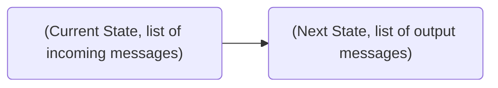

# QBFT Dafny by Roberto Saltini

This document attempts to explain [Roberto's QBFT Dafny specification](https://github.com/Consensys/qbft-formal-spec-and-verification/tree/main/dafny/spec/L1). [Dafny](https://github.com/dafny-lang/dafny) is a programming language used for formal verification of algorithms. It can verify correctness, termination property and that there are no runtime errors.

## Introduction

The code follows a `state machine transition` design, using `logic programming` `predicates` that validate the transition rules of the system.

There is a `Blockchain` entity which, basically, is comprised of a sequence of blocks. The Blockchain has `nodes`, out of which some are `validators`. The validators run `QBFT` as the consensus mechanism of the blockchain, adding a `block`, with incremental `height`, each time the consensus terminates.

The node has a `state`. The transition rule is the predicate [NodeNext](node.md) that verifies the transition:

The _NodeNext_ predicate is supposed to be called upon a [_clock tick_](https://entethalliance.github.io/client-spec/qbft_spec.html#dfn-qbftspecification:~:text=The%20predicate%20NodeNext,mwr.recipient), the period of which the messages are also considered transmitted and processed.

## Files
- [Types](types.md)
- [Auxiliary functions](auxiliary_functions.md)
- [Node](node.md) (main file)
- [Lemmas](lemmas.md) (helper file)