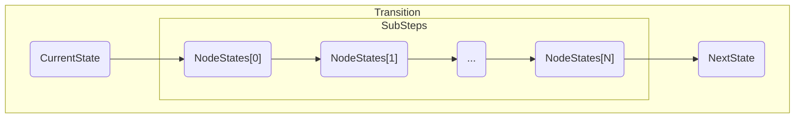

# Node

This is the main file, describing the transition rules of the system's state, both for the QBFT lifecycle and for a node.

## QBFT valid behavior existence

The main predicate is [`IsValidQbftBehavior`](https://github.com/Consensys/qbft-formal-spec-and-verification/blob/clarify_specification_behaviour/dafny/spec/L1/node.dfy#L34) which receives as input:
- a configuration (QBFT network)
- an ID (representing a node's address)
- a [QbftNodeBehaviour](types.md)

and returns true if there exists a sequence of `NodeStates` such that the behavior is valid for the given node in the given network. The predicate uses the [`IsValidQbftBehaviourStep`](https://github.com/Consensys/qbft-formal-spec-and-verification/blob/clarify_specification_behaviour/dafny/spec/L1/node.dfy#L62) predicate to validate each step.

`IsValidQbftBehaviourStep` receives a _QbftNodeBehaviour_, a list of _NodeStates_ and an _index_. It checks if NodeState[index] is valid and if the subsequent state, NodeState[index+1] is a valid transition using the `NodeNext` predicate.

## Node State Transition

### NodeInit

The [`NodeInit`](https://github.com/Consensys/qbft-formal-spec-and-verification/blob/clarify_specification_behaviour/dafny/spec/L1/node.dfy#L91) predicate receives a state, a network configuration and the node id and returns true if the state is an initial state (with variables set to their initial values).

### NodeNext

The [`NodeNext`](https://github.com/Consensys/qbft-formal-spec-and-verification/blob/clarify_specification_behaviour/dafny/spec/L1/node.dfy#L125) predicate receives:
- the current NodeState
- a set of incoming messages
- the next NodeState
- a set of expected output messages

and returns true if it's a valid transition. To be a valid transition, in this predicate, it means that there is a list of _NodeStates_ that links the current and next states and produces the expected output messages.

To verify each transition, the predicate `NodeNextSubStep` is called.

### NodeNextSubStep

The [`NodeNextSubStep`](https://github.com/Consensys/qbft-formal-spec-and-verification/blob/clarify_specification_behaviour/dafny/spec/L1/node.dfy#L186) predicate receives a current state, a next state and a list of output messages and returns true if there is a valid transition between such states that produces the expected messages. To verify such transition, each QBFT upon rule predicate is tested.

## QBFT Node transition

For every predicate discussed below, the input is:
- a current state
- a next state
- a set of expected output messages

Each returns true if the input represents a valid transition. The actual difference between the predicates is what each defines as a transition.

### [UponBlockTimeout](https://github.com/Consensys/qbft-formal-spec-and-verification/blob/clarify_specification_behaviour/dafny/spec/L1/node.dfy#L239)

This predicate verifies if:
- the last block has run out of time
- a proposal message was created, in case the node is the new proposer

### [UponProposal](https://github.com/Consensys/qbft-formal-spec-and-verification/blob/clarify_specification_behaviour/dafny/spec/L1/node.dfy#L281)

This predicate checks if:
- the proposal if valid
- a Prepare message was created and broadcast
- and the following state fields were updated:
    - _proposalAcceptedForCurrentRound_
    - round
    - time of start of round

### [UponPrepare](https://github.com/Consensys/qbft-formal-spec-and-verification/blob/clarify_specification_behaviour/dafny/spec/L1/node.dfy#L327)

This predicate checks if:
- there is a quorum of valid Prepare messages for the current height and round
- If so, verifies if:
    - a commit message was created and broadcast
    - the _last prepared round_ and _last prepared value_ were updated

### [UponCommit](https://github.com/Consensys/qbft-formal-spec-and-verification/blob/clarify_specification_behaviour/dafny/spec/L1/node.dfy#L395)

This predicate checks if:
- there is a quorum of valid Commit messages for the current height and round
- if so, verifies if:
    - the proposed block (added with the commit seals (signatures)) was added to the blockchain and broadcasted to other nodes
    - the QBFT variables were updated to their default values

### [UponTimeout](https://github.com/Consensys/qbft-formal-spec-and-verification/blob/clarify_specification_behaviour/dafny/spec/L1/node.dfy#L483)

This predicate verifies if:
- the round time has expired
- the round value is updated
- a round change message was created and broadcast

### [UponRoundChange](https://github.com/Consensys/qbft-formal-spec-and-verification/blob/clarify_specification_behaviour/dafny/spec/L1/node.dfy#L511)

This predicate verifies if:
- if the current state satisfies the [_hasReceivedProposalJustificationForLeadingRound_](./auxiliary_functions.md#proposal-and-round-change-functions) predicate, then
    - there exists a set of Round-Changes and Prepares that satisfies the _isReceivedProposalJustification_ predicate
    - a proposal was created and multicasted
    - the next state was updated with
        - the new round
        - _proposalAcceptedForCurrentRound_ to None
        - last round start time
        - messages received list
- else, if a partial quorum was reached, then
    - the next state was updated with
        - round as the minimum round
        - a created Round-Change message
        - _proposalAcceptedForCurrentRound_ to None

### [UponNewBlock](https://github.com/Consensys/qbft-formal-spec-and-verification/blob/clarify_specification_behaviour/dafny/spec/L1/node.dfy#L457)

This predicate simply verifies if:
- a valid block was received and
- _next state_ is equal to the _current state_ along with the QBFT variables set to the default value and with the block added to the Blockchain state
