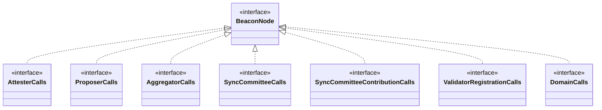
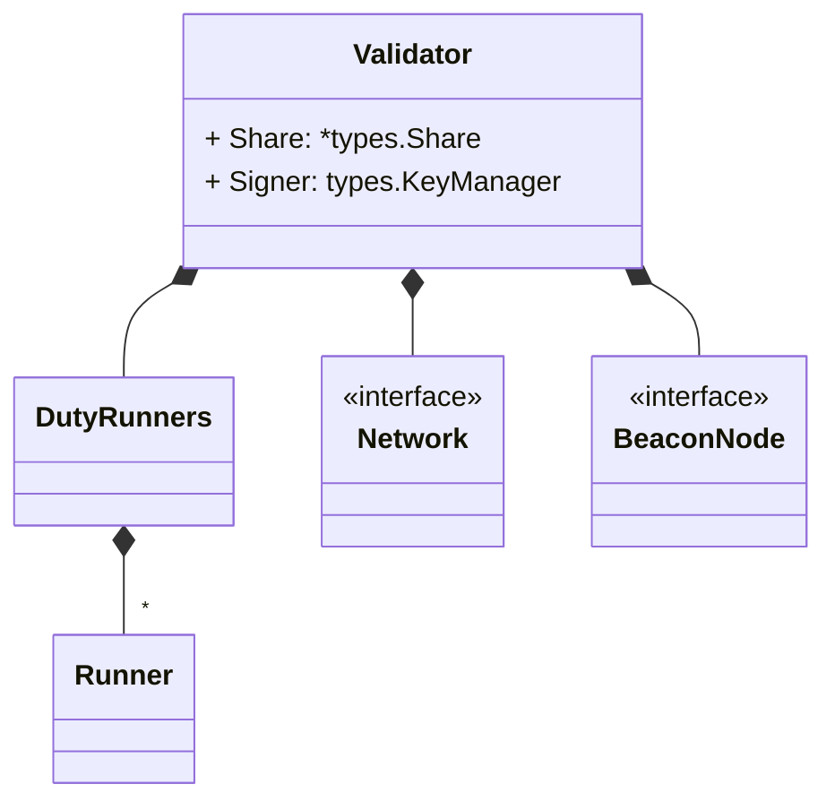
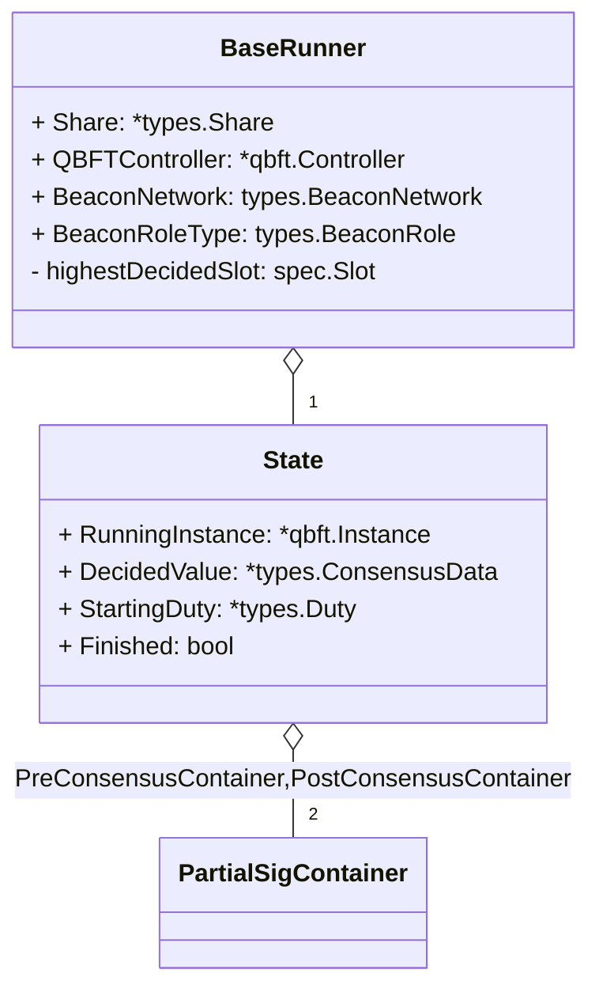

# Class Diagram

## Beacon Node

```mermaid
classDiagram

class AttesterCalls
<<interface>> AttesterCalls

class ProposerCalls
<<interface>> ProposerCalls

class AggregatorCalls
<<interface>> AggregatorCalls

class SyncCommitteeCalls
<<interface>> SyncCommitteeCalls

class SyncCommitteeContributionCalls
<<interface>> SyncCommitteeContributionCalls

class ValidatorRegistrationCalls
<<interface>> ValidatorRegistrationCalls

class DomainCalls
<<interface>> DomainCalls

class BeaconNode
<<interface>> BeaconNode

BeaconNode <|.. AttesterCalls
BeaconNode <|.. ProposerCalls
BeaconNode <|.. AggregatorCalls
BeaconNode <|.. SyncCommitteeCalls
BeaconNode <|.. SyncCommitteeContributionCalls
BeaconNode <|.. ValidatorRegistrationCalls
BeaconNode <|.. DomainCalls

```

## Validator

```mermaid
classDiagram

class DutyRunners

DutyRunners *-- "*" Runner

class Network
<<interface>> Network


class BeaconNode
<<interface>> BeaconNode


class Validator {
    + Share: *types.Share
    + Signer: types.KeyManager
}
Validator *-- DutyRunners
Validator *-- BeaconNode
Validator *-- Network


```

## BaseRunner

```mermaid
classDiagram

class PartialSigContainer

class State{
    + RunningInstance: *qbft.Instance
    + DecidedValue: *types.ConsensusData
    + StartingDuty: *types.Duty
    + Finished: bool
}
State o-- "2" PartialSigContainer: PreConsensusContainer,PostConsensusContainer

class BaseRunner{
    + Share: *types.Share
    + QBFTController: *qbft.Controller
    + BeaconNetwork: types.BeaconNetwork
    + BeaconRoleType: types.BeaconRole
    - highestDecidedSlot: spec.Slot
}
BaseRunner o-- "1" State


```

## Runners

```mermaid
classDiagram


class Network
<<interface>> Network


class BeaconNode
<<interface>> BeaconNode

class Runner
<<interface>> Runner

class BaseRunner
class ValidatorRegistrationRunner {
    - signer: types.KeyManager
    - valCheck: qbft.ProposedValueCheckF
}

ValidatorRegistrationRunner *-- "1" BeaconNode
ValidatorRegistrationRunner *-- "1" Network
ValidatorRegistrationRunner o-- "1" BaseRunner
ValidatorRegistrationRunner <|.. Runner


class SyncCommitteeRunner {
    - signer: types.KeyManager
    - valCheck: qbft.ProposedValueCheckF
}

SyncCommitteeRunner *-- "1" BeaconNode
SyncCommitteeRunner *-- "1" Network
SyncCommitteeRunner o-- "1" BaseRunner
SyncCommitteeRunner <|.. Runner


class SyncCommitteeAggregatorRunner {
    - signer: types.KeyManager
    - valCheck: qbft.ProposedValueCheckF
}

SyncCommitteeAggregatorRunner *-- "1" BeaconNode
SyncCommitteeAggregatorRunner *-- "1" Network
SyncCommitteeAggregatorRunner o-- "1" BaseRunner
SyncCommitteeAggregatorRunner <|.. Runner


class ProposerRunner {
    - signer: types.KeyManager
    - valCheck: qbft.ProposedValueCheckF
}

ProposerRunner *-- "1" BeaconNode
ProposerRunner *-- "1" Network
ProposerRunner o-- "1" BaseRunner
ProposerRunner <|.. Runner

class AttesterRunner {
    - signer: types.KeyManager
    - valCheck: qbft.ProposedValueCheckF
}

AttesterRunner *-- "1" BeaconNode
AttesterRunner *-- "1" Network
AttesterRunner o-- "1" BaseRunner
AttesterRunner <|.. Runner

class AggregatorRunner {
    - signer: types.KeyManager
    - valCheck: qbft.ProposedValueCheckF
}

AggregatorRunner *-- "1" BeaconNode
AggregatorRunner *-- "1" Network
AggregatorRunner o-- "1" BaseRunner
AggregatorRunner <|.. Runner


```